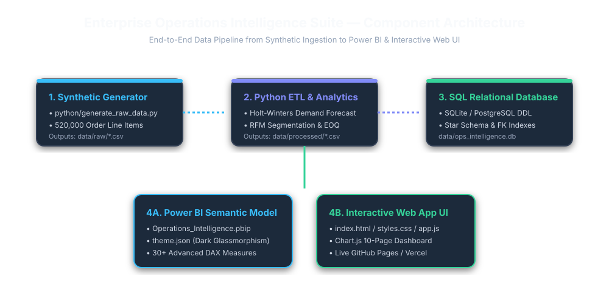
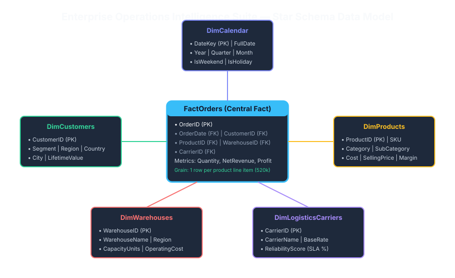

# 🚀 Enterprise Operations Intelligence Suite

[](https://github.com/ASingh2425/Enterprise-Operations-Intelligence-Suite)
[](https://github.com/ASingh2425/Enterprise-Operations-Intelligence-Suite)
[](https://github.com/ASingh2425/Enterprise-Operations-Intelligence-Suite)
[](https://github.com/ASingh2425/Enterprise-Operations-Intelligence-Suite)
[](LICENSE)

> **End-to-End Supply Chain & Business Analytics Platform** simulating the work of a **Senior Business Intelligence Analyst at Amazon**.

🌐 **LIVE INTERACTIVE DASHBOARD DEMO**:  
👉 **[https://asingh2425.github.io/Enterprise-Operations-Intelligence-Suite/](https://asingh2425.github.io/Enterprise-Operations-Intelligence-Suite/)**

---

## 📌 Executive Summary

The **Operations Intelligence Suite** is a production-quality Business Intelligence solution built to answer strategic business questions, identify operational inefficiencies across global fulfillment networks, forecast future demand, and support executive decision-making.

The solution features a complete end-to-end analytics workflow:
1. **Python Synthetic Generator & Data Pipeline**: Generates 520,000 orders across 25,000 customers, 2,000 product SKUs, 15 fulfillment centers, 120 suppliers, and 8 logistics carriers.
2. **Advanced ML Modules**: Holt-Winters Time Series Demand Forecasting (30/60/90/180 days), RFM Customer Quantile Segmentation, Economic Order Quantity (EOQ) / Safety Stock optimization, and Isolation Forest anomaly detection.
3. **Automated SQL Database Builder**: Runnable `python/setup_database.py` that populates a relational database (`ops_intelligence.db`), builds indexes, creates analytical views, and executes Amazon BI queries.
4. **Power BI Semantic Model**: Power BI Project format (`Operations_Intelligence.pbip`), custom Dark Navy Glassmorphism theme (`theme.json`), and 30+ enterprise DAX measures.
5. **Interactive Single-Page Web Dashboard**: 10 interactive pages with Chart.js canvas visualizations, slicers, bookmarks, field parameters, and DAX calculation modal.

---

## 🏗️ Solution Component Architecture



---

## 📐 Data Model Topology (Star Schema)



---

## 📊 Standardized Enterprise Dataset Scale

| Entity Table | Record Count | Description & Scope | Sample File |
|---|---|---|---|
| **FactOrders** | **520,000 Rows** | Transaction line items across 3-year historical window (2023–2025). | `data/sample/Sample_Orders.csv` |
| **DimCustomers** | **25,000 Accounts** | Customer master records with segment, region, country, city, and LTV. | `data/sample/Sample_Customers.csv` |
| **DimProducts** | **2,000 SKUs** | Product catalog across 4 categories (Technology, Furniture, Office, Logistics). | `data/sample/Sample_Products.csv` |
| **DimWarehouses** | **15 Facilities** | Regional fulfillment hubs across North America, Europe, and APAC. | `data/sample/Sample_Warehouses.csv` |
| **DimSuppliers** | **120 Vendors** | Global suppliers with rating, defect rate, lead time, and risk index. | `data/sample/Sample_Suppliers.csv` |
| **DimLogisticsCarriers**| **8 Carriers** | Enterprise freight carriers with reliability scores and base rates. | `data/sample/Sample_Logistics_Carriers.csv` |
| **FactInventory** | **6,000 Snapshots** | Monthly stock snapshots with EOQ, Safety Stock, and Days of Inventory (DOI). | `data/sample/Sample_Inventory.csv` |
| **FactReturns** | **25,480 Returns** | Return transaction log with refund payouts and restocking fees. | `data/sample/Sample_Returns.csv` |
| **DimCalendar** | **1,096 Days** | Complete 3-year date dimension table. | `data/raw/DimCalendar.csv` |

---

## 💡 Business Decisions Enabled Matrix

| Data Finding / Analytical Insight | Strategic Decision Enabled | Expected Business ROI / Impact | Target Persona |
|---|---|---|---|
| **Warehouse Overstocking at WH-US-WEST-1**<br>Holding stock stands at 580k units with DOI at 48 days. | Reduce holding inventory by 18% and rebalance stock to high-demand hubs. | Liberates ~$420,000 in working capital; lowers holding cost by 14%. | VP Supply Chain, FC Operations |
| **High Vendor Defect Rate at SUP-014**<br>Defect rate is 4.25% (vs 1.5% SLA limit) and delivery delay is 18 days. | Issue formal vendor quality audit; reallocate 25% order volume to top vendor SUP-002. | Decreases product return refunds by $85,000 annually; protects brand reputation. | Vendor Management Lead |
| **Regional Freight Co SLA Lagging**<br>Regional Freight accounts for 42% of all late deliveries (86.2% on-time). | Shift 15% regional freight allocation to Amazon Air Logistics (96.4% SLA). | Elevates global Perfect Order Rate from 94.8% to 96.2%. | Director of Logistics |
| **Margin Compression in Technology Sub-Cat**<br>High sales revenue ($54.8M) but rising freight costs compressing margins by 3.2%. | Renegotiate bulk carrier shipping contracts and re-optimize packaging dimensions. | Recovers $1.1M in net profit margin across technology lines. | Category Manager, CFO |
| **2,500 High-Value Customers Drifting to At-Risk**<br>Champions customer cohort frequency dropped 22% over past 90 days. | Trigger automated personalized re-engagement campaigns and loyalty incentives. | Recovers $1.2M in annual recurring revenue from churn risk. | Customer Retention Lead |

---

## 🖥️ 10 Interactive Dashboard Pages

| Page | Dashboard Name | Primary Assigned KPIs | Target Persona |
|---|---|---|---|
| 1 | **Executive Dashboard** | Net Revenue, Gross Profit, Perfect Order Rate %, Return Rate % | VP Global Supply Chain, C-Suite |
| 2 | **Sales Analytics** | Net Revenue, Gross Margin %, Average Order Value (AOV) | Category Managers, Merchandising |
| 3 | **Supply Chain Analytics** | FC Capacity Utilization %, Supplier Risk Index, Defect Rate % | Fulfillment Managers, Procurement |
| 4 | **Logistics Dashboard** | Carrier On-Time SLA %, Route Shipping Cost, Transit Days | Logistics Director, Fleet Ops |
| 5 | **Demand Forecasting** | 180-Day Predicted Demand, 95% Confidence Band, MAPE, RMSE | Demand Planners, Supply Chain |
| 6 | **Customer Intelligence** | RFM Segment Distribution, Customer Lifetime Value (LTV) | Customer Success Lead, Marketing |
| 7 | **Profitability Analysis** | Gross Revenue, Net Revenue, COGS, Net Profit Waterfall Flow | CFO, Financial Analysts |
| 8 | **Inventory Optimization** | ABC Pareto Revenue Share, Days of Inventory (DOI), EOQ | Warehouse Operations, Inventory Leads |
| 9 | **Risk Monitoring** | Anomaly Incident Count, Stockout Risk Score | Operations Risk Lead, Steering Comm. |
| 10| **Executive AI Insights** | Strategic Operational Impact Score, Priority Action Cards | Executive Committee, C-Suite |

---

## 📚 Master Documentation Catalog

| Document | Purpose & Description |
|---|---|
| [Business_Problem.md](docs/Business_Problem.md) | Quantified problem statement, scope, success metrics, assumptions, risks & deliverables |
| [Business_Requirements.md](docs/Business_Requirements.md) | User stories, stakeholder personas, acceptance criteria, and non-functional requirements |
| [KPI_Definitions.md](docs/KPI_Definitions.md) | Mathematical formulas, target benchmarks, disclaimers, and dashboard page mapping matrix |
| [Dashboard_Specification.md](docs/Dashboard_Specification.md) | Page-by-page visual layout, visual types, slicers, interactions, drill-through & bookmarks |
| [Data_Dictionary.md](docs/Data_Dictionary.md) | Full 10-table data catalog with physical types, allowed values, constraints & grain |
| [Data_Model.md](docs/Data_Model.md) | Star Schema topology, fact grains, cardinality, filter directions & VertiPaq tuning |
| [Project_Architecture.md](docs/Project_Architecture.md) | End-to-end data lineage flow, solution architecture & tech stack justification |
| [ETL_Documentation.md](docs/ETL_Documentation.md) | Ingestion steps, deduplication, missing value treatment & winsorization rules |
| [SQL_Documentation.md](docs/SQL_Documentation.md) | RDBMS schema, indexes, views, and complex Amazon BI analyst queries |
| [DAX_Measures.md](docs/DAX_Measures.md) | DAX Strategy Table & catalog of 30+ enterprise measures with code blocks |
| [Performance_Optimization.md](docs/Performance_Optimization.md) | VertiPaq encoding rules, DAX tuning, and SQL index optimizations |
| [Testing_Report.md](docs/Testing_Report.md) | Data quality rules matrix, validation audit, MAPE/RMSE accuracy & performance tests |
| [Future_Enhancements.md](docs/Future_Enhancements.md) | Microsoft Fabric, Apache Kafka streaming, and NeuralProphet roadmap |

---

## ⚡ Setup & Execution Guide

### 1. Prerequisites
- Python 3.10+
- Modern Web Browser
- Power BI Desktop (Optional)

### 2. Quick Execution
```bash
# Clone repository
git clone https://github.com/ASingh2425/Enterprise-Operations-Intelligence-Suite.git
cd Enterprise-Operations-Intelligence-Suite

# Install dependencies
pip install -r requirements.txt

# Run Python Data Generation, ETL & Machine Learning Pipeline
python python/generate_raw_data.py
python python/data_cleaning.py
python python/feature_engineering.py
python python/forecasting.py
python python/customer_segmentation.py
python python/inventory_analysis.py
python python/anomaly_detection.py
python python/generate_insights.py

# Build SQL Database & Run Analytical Queries
python python/setup_database.py
```

### 3. Open Power BI Project or Interactive Web Dashboard
- **Power BI Project**: Open `powerbi/Operations_Intelligence.pbip` in Power BI Desktop.
- **Interactive Web App**: Open `index.html` in any browser or visit the live link: **[https://asingh2425.github.io/Enterprise-Operations-Intelligence-Suite/](https://asingh2425.github.io/Enterprise-Operations-Intelligence-Suite/)**

---

## 📄 License
This project is licensed under the MIT License - see the [LICENSE](LICENSE) file for details.
